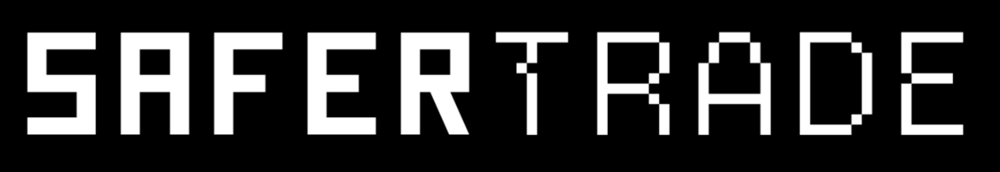

<p align="center">
  
</p>

<p align="center">
  <strong>Real-time DeFi threat detection and risk intelligence platform</strong>
</p>

<p align="center">
  <a href="LICENSE"></a>
  <a href="https://python.org"></a>
  <a href="https://redis.io"></a>
  <a href="https://github.com/hallosoares/safertrade/actions/workflows/tests.yml"></a>
  <a href="#detection-engines"></a>
  <a href="https://github.com/hallosoares/safertrade/commits/main"></a>
  <a href="CONTRIBUTING.md"></a>
</p>

---

## Table of Contents

- [What is SaferTrade?](#what-is-safertrade)
- [Architecture](#architecture)
- [Detection Engines](#detection-engines)
- [Quick Start](#quick-start)
  - [Docker (Recommended)](#docker-recommended)
  - [Manual Installation](#manual-installation)
- [Multi-Chain Support](#multi-chain-support)
- [Configuration](#configuration)
- [API Reference](#api-reference)
- [Examples](#examples)
- [Contributing](#contributing)
- [License](#license)

---

## What is SaferTrade?

SaferTrade is the **only open-source, production-ready** DeFi threat detection platform. While other projects document threats, we detect them in real-time across 7 blockchain networks with 10+ specialized engines.

**Key differentiators:**
- Working detection code (not just documentation)
- Real-time monitoring via Redis Streams
- Multi-chain support out of the box
- Modular engine architecture for extensibility

---

## Architecture

```
                                    SAFERTRADE ARCHITECTURE
    
    ┌─────────────────────────────────────────────────────────────────────────────┐
    │                              DATA SOURCES                                    │
    │  ┌──────────┐ ┌──────────┐ ┌──────────┐ ┌──────────┐ ┌──────────┐           │
    │  │ Ethereum │ │   Base   │ │ Polygon  │ │ Arbitrum │ │  Solana  │  + more   │
    │  │   RPC    │ │   RPC    │ │   RPC    │ │   RPC    │ │   RPC    │           │
    │  └────┬─────┘ └────┬─────┘ └────┬─────┘ └────┬─────┘ └────┬─────┘           │
    │       │            │            │            │            │                  │
    └───────┼────────────┼────────────┼────────────┼────────────┼──────────────────┘
            │            │            │            │            │
            └────────────┴────────────┼────────────┴────────────┘
                                      │
                                      ▼
    ┌─────────────────────────────────────────────────────────────────────────────┐
    │                           DETECTION ENGINES                                  │
    │                                                                              │
    │  ┌─────────────────┐  ┌─────────────────┐  ┌─────────────────┐              │
    │  │    Honeypot     │  │  Pump & Dump    │  │     Oracle      │              │
    │  │    Checker      │  │   Detector      │  │  Manipulation   │              │
    │  └────────┬────────┘  └────────┬────────┘  └────────┬────────┘              │
    │           │                    │                    │                        │
    │  ┌─────────────────┐  ┌─────────────────┐  ┌─────────────────┐              │
    │  │   Stablecoin    │  │     Token       │  │    Phishing     │              │
    │  │  Depeg Monitor  │  │ Holder Analyzer │  │    Detector     │              │
    │  └────────┬────────┘  └────────┬────────┘  └────────┬────────┘              │
    │           │                    │                    │                        │
    └───────────┼────────────────────┼────────────────────┼────────────────────────┘
                │                    │                    │
                └────────────────────┼────────────────────┘
                                     │
                                     ▼
    ┌─────────────────────────────────────────────────────────────────────────────┐
    │                            REDIS STREAMS                                     │
    │                                                                              │
    │    safertrade:results    signals.honeypot    signals.pump    signals.oracle  │
    │          │                                                                   │
    └──────────┼───────────────────────────────────────────────────────────────────┘
               │
               ▼
    ┌─────────────────────────────────────────────────────────────────────────────┐
    │                              OUTPUTS                                         │
    │                                                                              │
    │  ┌──────────────┐  ┌──────────────┐  ┌──────────────┐  ┌──────────────┐     │
    │  │   REST API   │  │  WebSocket   │  │   Telegram   │  │   Webhooks   │     │
    │  │   /api/v1    │  │    Alerts    │  │    Alerts    │  │   Callbacks  │     │
    │  └──────────────┘  └──────────────┘  └──────────────┘  └──────────────┘     │
    │                                                                              │
    └─────────────────────────────────────────────────────────────────────────────┘
```

---

## Detection Engines

| Engine | Threat Type | Description |
|--------|-------------|-------------|
| `honeypot_checker` | Contract Risk | Detects honeypot contracts that prevent token selling |
| `pump_detector` | Market Manipulation | Identifies coordinated pump-and-dump schemes |
| `oracle_manipulation_detector` | Price Attack | Monitors for oracle price manipulation attempts |
| `stablecoin_depeg_monitor` | Peg Risk | Tracks stablecoin deviations from peg |
| `token_holder_analyzer` | Concentration Risk | Analyzes whale concentration and distribution |
| `phishing_detector` | Fraud | Identifies known phishing addresses and patterns |
| `gas_price_optimizer` | Cost | Monitors gas price anomalies and optimization |
| `health_check` | System | Platform health monitoring |
| `ohlcv_data_feed` | Data | Market data aggregation and validation |
| `alert_processor` | Delivery | Alert routing and multi-channel delivery |

---

## Quick Start

### Docker (Recommended)

The fastest way to get started:

```bash
# Clone repository
git clone https://github.com/hallosoares/safertrade.git
cd safertrade

# Configure environment
cp .env.example .env
# Edit .env with your RPC endpoints

# Start everything
docker-compose up -d

# View logs
docker-compose logs -f api

# API is now available at http://localhost:8000
```

**Verify it's running:**
```bash
curl http://localhost:8000/health
```

### Manual Installation

#### Prerequisites
- Python 3.11+
- Redis 7.0+
- RPC endpoints for target chains

#### Installation

```bash
# Clone repository
git clone https://github.com/hallosoares/safertrade.git
cd safertrade

# Create virtual environment
python -m venv venv
source venv/bin/activate  # Linux/Mac
# or: venv\Scripts\activate  # Windows

# Install dependencies
pip install -r requirements.txt

# Configure environment
cp .env.example .env
# Edit .env with your RPC endpoints

# Start Redis (if not running)
redis-server &

# Run the API
uvicorn api.main:app --reload
```

---

## Examples

### Detect a Honeypot Token

```python
from engines.honeypot_checker.engine import HoneypotChecker
from shared.redis_client import get_redis_client

# Initialize
redis = get_redis_client()
checker = HoneypotChecker(redis)

# Check a token
result = checker.check_token("0x...")

if result.is_honeypot:
    print(f"WARNING: Honeypot detected!")
    print(f"Risk score: {result.risk_score}")
    print(f"Reason: {result.reason}")
else:
    print("Token appears safe")
```

### Subscribe to Real-Time Alerts

```python
import json
from shared.redis_client import get_redis_client

redis = get_redis_client()
last_id = "$"

print("Waiting for alerts...")
while True:
    messages = redis.xread({"safertrade:results": last_id}, block=5000)
    if messages:
        for stream, entries in messages:
            for entry_id, data in entries:
                alert = json.loads(data.get("data", "{}"))
                print(f"Alert: {data.get('type')} - Risk: {alert.get('risk_score')}")
                last_id = entry_id
```

See [examples/](examples/) for more:
- `honeypot_detection.py` - Check tokens for honeypot characteristics
- `pump_dump_detection.py` - Detect pump-and-dump schemes
- `realtime_alerts.py` - Subscribe to live alerts
- `webhook_integration.py` - Forward alerts to Discord/Slack
- `multi_chain_monitoring.py` - Monitor multiple chains

---

## Multi-Chain Support

SaferTrade monitors threats across multiple networks:

| Network | Chain ID | Status |
|---------|----------|--------|
| Ethereum | 1 | Supported |
| Base | 8453 | Supported |
| Polygon | 137 | Supported |
| Optimism | 10 | Supported |
| Arbitrum | 42161 | Supported |
| Blast | 81457 | Supported |
| Solana | - | Supported |

---

## Configuration

Key environment variables:

| Variable | Description | Required |
|----------|-------------|----------|
| `REDIS_URL` | Redis connection string | Yes |
| `RPC_ETHEREUM` | Ethereum RPC endpoint | Yes |
| `RPC_BASE` | Base RPC endpoint | Yes |
| `RPC_POLYGON` | Polygon RPC endpoint | Optional |
| `LOG_LEVEL` | Logging verbosity (DEBUG, INFO, WARNING) | No |

See [.env.example](.env.example) for full configuration reference.

---

## API Reference

When running the API server, documentation is available at:

- **Swagger UI**: `http://localhost:8000/docs`
- **ReDoc**: `http://localhost:8000/redoc`

### Example Endpoints

```bash
# Health check
curl http://localhost:8000/health

# Check token safety
curl http://localhost:8000/api/v1/token/0x.../safety

# Get whale movements
curl "http://localhost:8000/api/v1/whale/movements?chain=ethereum&limit=100"
```

---

## Project Structure

```
safertrade/
├── engines/           # Detection engines (modular, independent)
│   ├── honeypot_checker/
│   ├── pump_detector/
│   └── ...
├── shared/            # Common utilities and clients
├── schemas/           # Data models and validation
├── data/              # Static data (phishing lists, etc.)
├── docs/              # Documentation
├── examples/          # Usage examples
└── tests/             # Test suite
```

---

## Contributing

We welcome contributions! Check out our [good first issues](https://github.com/hallosoares/safertrade/labels/good%20first%20issue) to get started.

### Development Setup

```bash
# Install dev dependencies
pip install -r requirements-dev.txt

# Run tests
pytest

# Run linter
ruff check .

# Type checking
mypy engines/ shared/
```

See [CONTRIBUTING.md](CONTRIBUTING.md) for guidelines.

---

## Security

For security vulnerabilities, see [SECURITY.md](SECURITY.md). Do not open public issues for security concerns.

**Responsible Disclosure**: security@safertrade.io

---

## License

Business Source License 1.1 (BUSL-1.1)

### You CAN:
- Use SaferTrade for your own DeFi operations (personal/internal)
- Run it on your own infrastructure
- Study the code, fork it, and contribute improvements
- Use it for research, testing, learning, and development

### You CANNOT (without a commercial license):
- Offer SaferTrade as a paid service to others
- Include it in a commercial product you sell
- Use it in production for a business generating revenue

**Change Date**: December 10, 2029 (converts to Apache 2.0)

**Commercial License**: For enterprise/production use, contact the maintainers.

See [LICENSE](LICENSE) and [LICENSE_FAQ.md](LICENSE_FAQ.md) for details.

---

## Support

- **Documentation**: [docs/](docs/)
- **Issues**: [GitHub Issues](https://github.com/hallosoares/safertrade/issues)
- **Discussions**: [GitHub Discussions](https://github.com/hallosoares/safertrade/discussions)

---

<p align="center">
  <sub>Built for the DeFi community. Protect your investments.</sub>
</p>
